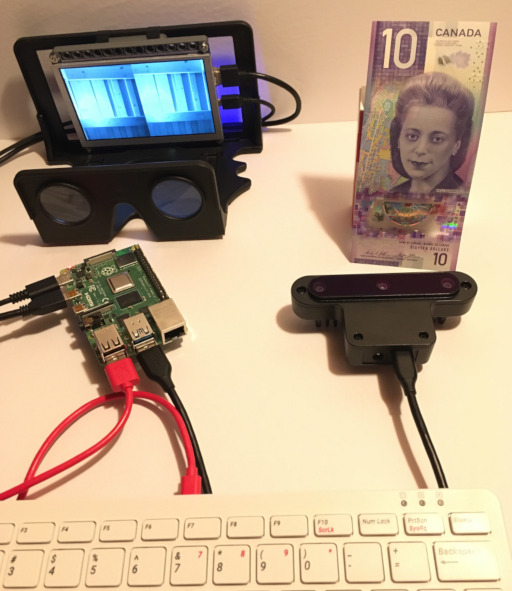
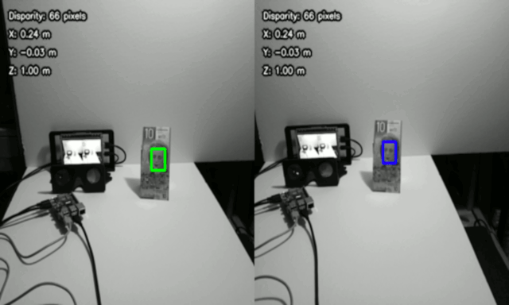

# Raspberry-Pi-Stereoscope-AR
Exploring Luxonis' Oak-D on a Raspberry Pi with a stereoscope. 
 
# Hardware
Raspberry Pi 4 Model B (tested 4GB version) 
Raspberry Pi 3 Model B+ (tested 1GB version) 
Pi Zero W (worked but lower performance, should test on Pi Zero 2 W) 

Luxonis' Oak-D 

(Oak-D was available early December 2021 to start learning. Oak-D-Lite is expected to ship April 2022 at a lower cost and a smaller size.) 

OWL Stereoscopic Viewer from The London Stereoscopic Company Ltd 

Adafruit HDMI 5" 800x480 Display Backpack (resistive touchscreen not used) 

(author has this display sitting around, power from a separate 5V source, Pi 4 is not able to power both Oak-D and display) 

# Software
Raspberry Pi OS with desktop 
Release date: October 30th 2021 
Kernel version: 5.10 
Size: 1,148MB 

# Installation

https://docs.luxonis.com/projects/api/en/latest/install/?highlight=raspberry%20pi#raspberry-pi-os

<pre>
sudo curl -fL https://docs.luxonis.com/install_dependencies.sh | bash
</pre>

# Experiment 1 

Brandon Gilles' youtube "Stereo Neural Inference on OAK-D-Lite" is a starting point for this experiment. 

https://www.youtube.com/watch?v=-WqDyLV3QjE

Experiment 1 is based on main.py from https://github.com/luxonis/depthai-experiments/tree/master/gen2-triangulation. 

Change line ~294 

<pre>
        cv2.imshow("Combined frame", np.concatenate((left, combined ,right), axis=1))
</pre>

to

<pre>
        # for 800x480 hdmi display
        cv2.namedWindow("Stereoscope AR", cv2.WND_PROP_FULLSCREEN)
        cv2.setWindowProperty("Stereoscope AR",cv2.WND_PROP_FULLSCREEN,cv2.WINDOW_FULLSCREEN)
        imOut = np.hstack((right, left)) # switch left right for stereoscope AR
        resize = cv2.resize(imOut, (800,480), interpolation = cv2.INTER_LINEAR)
        cv2.imshow("Stereoscope AR", resize)
</pre>

# References 

https://www.luxonis.com/

https://www.raspberrypi.com/

https://www.londonstereo.com/

https://docs.luxonis.com/en/latest/

https://docs.luxonis.com/projects/api/en/latest/install/?highlight=raspberry%20pi#raspberry-pi-os

https://github.com/luxonis/depthai-python

https://github.com/luxonis/depthai-experiments

Adafruit still make this display since 2014. 

https://www.adafruit.com/product/2260

Pi 4 auto setup hdmi without manually changing /boot/config.txt. Not sure if it's the hardware or software detecting display connected to it. So, no need to follow instruction below. 

https://learn.adafruit.com/adafruit-5-800x480-tft-hdmi-monitor-touchscreen-backpack/raspberry-pi-config

 Copyright (c) 2021 Hartwell Fong 
